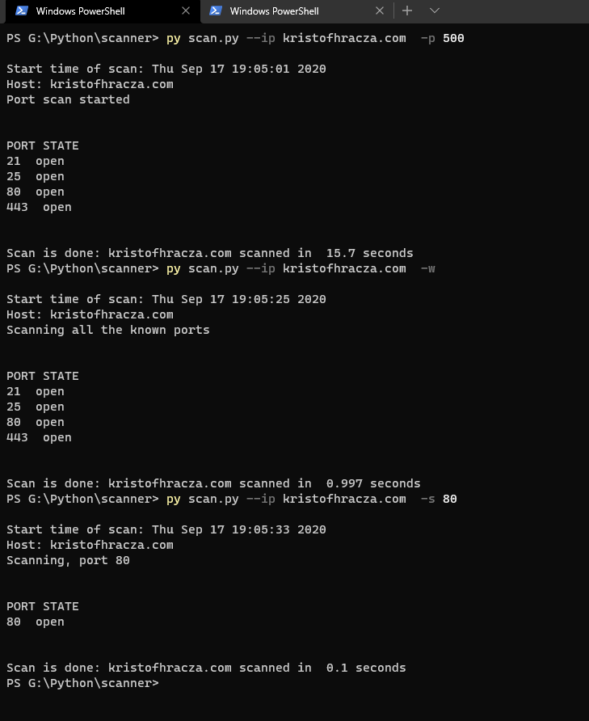

# Network Scanner
A network scanner, inspired by Nmap.

# Preview
 
 
 # Usage
 ```
 Usage: scan.py [kwargs]
    
    ARGUMENTS (kwargs):
      REQUIRED:
        --ip: 
          The IP of the 'victim'
      OPTIONAL (One of these are needed):
        -p or --portscan [port limit]:
          Just a simple scan up until the given port number.
        ###################################
        -w or --wp:
          Scan through all of the well known ports.
         ###################################
        -s or --specificport [port]:
          Scans a specific port.
      HELP:
       -h or --help: 
 ```
 
 # Packages (to be installed)
 - ``` pip install -r requirements.txt ```
 
 # Type of Scans
 - Simple port scan: Scans a given amount of port, can be set with ```-p [num] ```
 - Well know port scan: Scans through all the well know ports, can be set with ```-w ```
 
