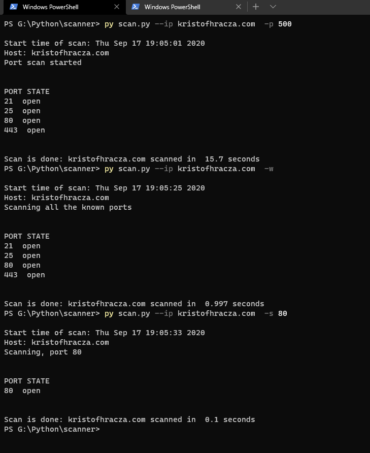
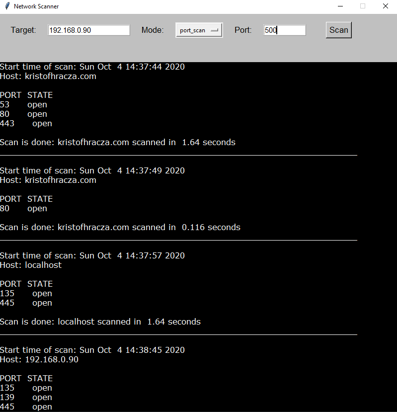

# Network Scanner
A network scanner, inspired by Nmap.

# Scans and usage:

| Name                | Command                     | Explanation                      |
|---------------------|-----------------------------|----------------------------------|
| Simple port scan    | -p or --portscan [limit]    | Scans up until the limit         |
| Well know port scan | -w or --wp                  | Scans a pre-defined set of ports |
| Specific port scan  | -s or --specificport [port] | Scans one specific port          |


# Packages (to be installed):
 - ``` pip install -r requirements.txt ```

# Preview
  ## Terminal
 
  ## GUI
 
 
 
